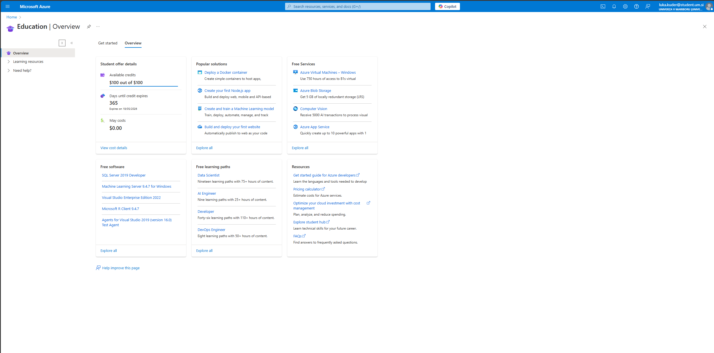

# Poročilo o vzpostavitvi Azure skupine Kaput

## Dostop do storitve Azure
Dostop do storitve Azure smo dobili tako da smo sledili naslednjim korakom:
- Po kliku na ta [link](https://azure.microsoft.com/en-us/pricing/purchase-options/azure-account?icid=azurefaq) smo kliknili na gumb `Try for Free`, nakar smo se prijavili z računom vodje skupine.
- Med prijavo smo vnašali zahtevane podatke, kar je zahtevalo tudi `Company VatId`, kamor smo vnesli davčno številko Feri-ja.
- Po uspešni prijavi smo bili preusmerjeni na Azure portal:

## Ustvarjanje Linux virtualne naprave
Po registraciji smo ustvarili Linux VM z naslednjimi koraki:
- Po kliku na ta [link](https://portal.azure.com/#view/Microsoft_Azure_Billing/FreeServicesBlade) smo kliknili na gumb `Create` v lističu `Linux Virtual Machine`.

- Nato smo izpomnili obrazec za ustvarjanje VM-ja, tako da smo sledili navodilom na `eŠtudij-u`.

- Po kliku na gumb `Review + create` in še enkrat na `Create` je bil VM ustvarjen.