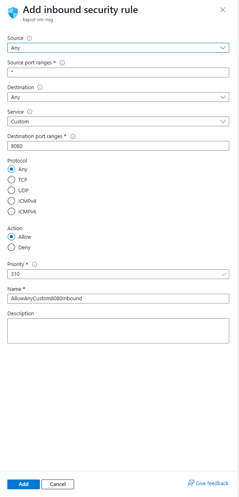

# Poročilo o vzpostavitvi Azure skupine Kaput

## Dostop do storitve Azure
Dostop do storitve Azure smo dobili tako da smo sledili naslednjim korakom:
- Po kliku na ta [link](https://azure.microsoft.com/en-us/pricing/purchase-options/azure-account?icid=azurefaq) smo kliknili na gumb `Try for Free`, nakar smo se prijavili z računom vodje skupine.
- Med prijavo smo vnašali zahtevane podatke, kar je zahtevalo tudi `Company VatId`, kamor smo vnesli davčno številko Feri-ja.
- Po uspešni prijavi smo bili preusmerjeni na Azure portal:


## Ustvarjanje Linux virtualne naprave
Po registraciji smo ustvarili Linux VM z naslednjimi koraki:
- Po kliku na ta [link](https://portal.azure.com/#view/Microsoft_Azure_Billing/FreeServicesBlade) smo kliknili na gumb `Create` v lističu `Linux Virtual Machine`.


- Nato smo izpolnili obrazec za ustvarjanje VM-ja, tako da smo sledili navodilom na `eŠtudij-u`.


- Po kliku na gumb `Review + create` in še enkrat na `Create` je bil VM ustvarjen.

## Zagotovitev SSH dostopa do VM-ja
Dostop smo zagotovili tako, da smo za vsakega člana naredili posebej uporabnika. Temu smo dodelili tudi pravice `sudo`. 

Postopek:
- Prijava na VM preko SSH:
```
ssh kaput@20.82.89.167

# Vnesemo geslo, ki smo ga izbrali ob ustvarjanju VM-ja
```

- Ustvarjanje uporabnikov in dodelitev pravic `sudo`:
```
# Pri ustvarjanju vsakega uporabnika sem vnesel tudi njegovo geslo, ter nato klikal enter, tako da so bile za ostale podatke uporabljene privzete vrednosti.

sudo adduser lukak
sudo adduser enejk
sudo adduser davidg

sudo groupadd kaput

sudo usermod -aG kaput lukak
sudo usermod -aG kaput enejk
sudo usermod -aG kaput davidg

sudo mkdir -p /srv/kaput

# Nastavimo skupino za lastnico mape, da lahko vsi v njej spreminjamo stvari
sudo chown -R :kaput /srv/kaput
sudo chmod g+rwx /srv/kaput
sudo chmod g+s /srv/kaput

sudo reboot
```

- Po tem sem spremenil nastavitve SSH dostopa, da dovolijo dostop preko uporabniškega imena in gesla:
```
sudo nano /etc/ssh/sshd_config

# Odkomentiramo naslednjo vrstion:
PasswordAuthentication yes

systemctl restart ssh
```

Po tem se lahko prijavimo na VM preko SSH z uporabo `ssh <username>@<ip>`.

Primer:


# Odgovori na vprašanja:

## 1. Kje in kako omogočite "port forwarding"?

Port forwarding omogočimo tako, da v levem navigacijskem stolpcu na strani našega VM-ja kliknemo ``Networking``, in nato ``Network settings``. Tam lahko vidimo sledeče:


Na dnu strani lahko vidimo že obstoječa pravila. Če želimo dodati novega, kliknemo na gumb `Create port rule` in nato Inbound port rule.


To odpre naslednje okno:



Nato moramo izpolniti naslednji obrazec, ki vsebuje:
- **Source:** Iz katerih IP-jev lahko dostopamo do VM-ja oziroma za katere velja to pravilo
- **Source port ranges:** Iz katerih port-ov lahko dostopamo do VM-ja oziroma za katere velja to pravilo
- **Destination:** Za promet na katere IP-je velja to pravilo (večinoma je to samo IP VM-ja)
- **Service:** Določi protokol in za katere port-e velja pravilo
- **Destination port ranges:** Za dostope do katerih port-ov velja to pravilo
- **Protocol:** Any, TCP, UDP, ICMPv4 ali ICMPv6
- **Action:** Določi ali bo pravilo sprejelo ali zavrnilo promet
- **Priority:** Določi prioriteto pravila, če obstaja več pravil, nižja kot je številka, višja je prioriteta. Številka mora biti unikatna med vsemi pravili.
- **Name:** Ime pravila
- **Description:** Opis pravila

Ko smo izpolnili vse potrebne podatke, kliknemo na gumb `Add` in pravilo je dodano.


## 2. Kakšen tip diska je bil dodan vaši navidezni napravi in kakšna je njegova kapaciteta?

Da vidimo podatke o disku našega VM-ja, kliknemo na ``Overview`` v levem navigacijskem stolpcu, nakar pod ``Properties``, ki so privzeto že odprti, kliknemo na ``Disk``.
Odpre se nam sledeča stran:


Tukaj lahko vidimo, da je naši napravi bil dodan disk tipa ``Premium SSD LRS``, z kapaciteto ``64 GB``.

## 3. Kje preverimo stanje trenutne porabe virov v naši naročnini ("Azure for students")?

Stanje porabe v naročnini lahko preverimo tako, da gremo v ``Cost Management + Billing``. Do tja lahko pridemo tako, da to vnesemo v iskalnik na vrhu strani, ali pa s tem, da gremo na osnovno stran, kliknemo ``All services`` in nato ``Cost Management + Billing``.

To nas preusmeri na sledečo stran, kjer lahko vidimo koliko virov smo porabili in koliko nam jih še ostane:


Če v tem oknu pod ``Cost Management`` kliknemo ``Cost analysis``, lahko vidimo podrobnejše podatke o porabi virov. Ti so pri nas prazni, saj zaenkrat nismo uporabili še ničesar, kar ni vključeno v študentski paket.


# Vzpostavitev Docker aplikacije na VM-ju

## Uporaba Git-a za prenos kode

Da smo lahko kodo prenesli na VM, smo morali vzpostaviti avtentikacijo Git-a z SSH ključi. To smo naredili tako, da smo na VM-ju ustvarili SSH ključ in ga dodali v GitHub nastavitve. Postopek:
- Na VM-ju smo odprli terminal in vnesli naslednje ukaze:
    - `ssh-keygen -t ed25519 -C "luka.kuder@gmail.com"` (To ustvari 2 ključa, javnega in zasebnega)
    - `cat ~/.ssh/id_ed25519.pub` (To prikaže javni ključ, ki ga moramo kopirati v GitHub nastavitve)
- Po tem smo šli na `https://github.com/settings/keys`, kjer smo kliknili na gumb `New SSH key`, vnesli ime ključa in prilepili javni ključ, ki smo ga dobili prej in kliknili `Add SSH key`. (Povezavo smo testirali z `ssh -T git@github.com`)

Prikaz dodanega SSH ključa na GitHub-u:


- Po tem smo prenesli kodo iz repozitorija na VM z ukazom `git clone git@github.com:KaputProject/spletno.git`, kar je preneslo celoten repozitorij na VM.


## Uporaba Dockerja za zagon aplikacije
Najprej smo namestili docker:
```
sudo apt install docker.io docker-compose -y

sudo systemctl enable docker
sudo systemctl start docker
```

Nato pa še vspostavili aplikacijo:
```
cd ../../srv/kaput/spletno

git checkout develop

# Ustvarimo .env datoteki v /backend in /frontend, tako da kopiramo .env.example:
cd backend
cp .env.example .env
sudo nano .env
# V .env datoteki backenda dodamo na novo generiran JWT ključ, ostale nastavitve pa ohranimo.

cd ..
cd frontend
cp .env.example .env
# Tukaj vse vrednosti pustimo na privzetih

sudo docker-compose up --build

sudo docker-compose up
```

Če je bilo vse uspešno bo izpis približno tak:


Da bo lahko server sprejemal zahteve na port 80 moremo narediti še nov `Port rule`:


Tukaj smo naleteli na problem, saj naša docker slika uporablja približno 800MB pomnilnika, saj smo za frontend vključili nekaj knjižnic, ki jih bomo uporabili za oblikovanje.

Ker je VM, ki smo ga originalno naredili imel samo 1 GB pomnilnika, je po tem, ko smo zagnali sudo docker-compose up --build postal praktično neodziven.

Zaradi tega smo se odločili, da bomo ustvarili nov VM, ki ima 2 GB pomnilnika. Postopek za ustvarjanje je bil popolnoma isti, samo da smo izbrali naslednjo opcijo:


Po tem ko smo ponovili celoten postopek se nam je pokazala spletna stran:


