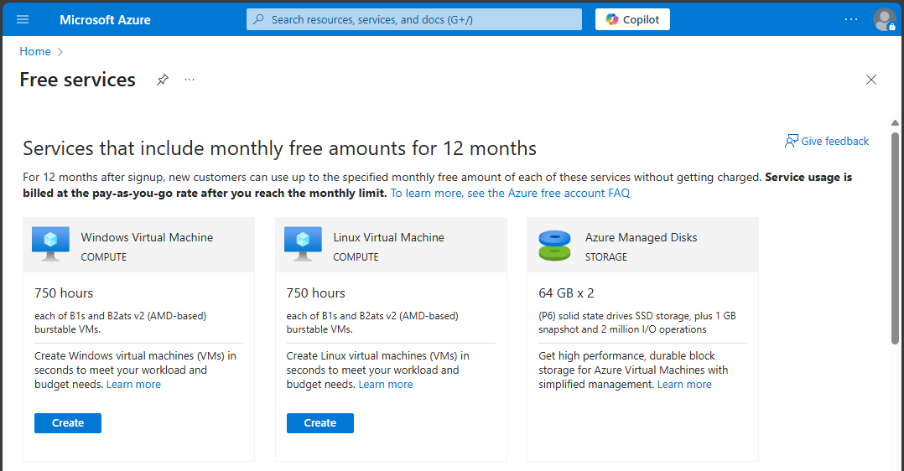

# Poročilo o vzpostavitvi Azure skupine Kaput

## Dostop do storitve Azure
Dostop do storitve Azure smo dobili tako da smo sledili naslednjim korakom:
- Po kliku na ta [link](https://azure.microsoft.com/en-us/pricing/purchase-options/azure-account?icid=azurefaq) smo kliknili na gumb `Try for Free`, nakar smo se prijavili z računom vodje skupine.
- Med prijavo smo vnašali zahtevane podatke, kar je zahtevalo tudi `Company VatId`, kamor smo vnesli davčno številko Feri-ja.
- Po uspešni prijavi smo bili preusmerjeni na Azure portal:

## Ustvarjanje Linux virtualne naprave
Po registraciji smo ustvarili Linux VM z naslednjimi koraki:
- Po kliku na ta [link](https://portal.azure.com/#view/Microsoft_Azure_Billing/FreeServicesBlade) smo kliknili na gumb `Create` v lističu `Linux Virtual Machine`.

- Nato smo izpolnili obrazec za ustvarjanje VM-ja, tako da smo sledili navodilom na `eŠtudij-u`.

- Po kliku na gumb `Review + create` in še enkrat na `Create` je bil VM ustvarjen.

# Odgovori na vprašanja:

## 1. Kje in kako omogočite "port forwarding"?

Port forwarding omogočimo tako, da v levem navigacijskem stolpcu na strani našega VM-ja kliknemo ``Networking``, in nato ``Network settings``. Tam lahko vidimo sledeče:

Na dnu strani lahko vidimo že obstoječa pravila. Če želimo dodati novega, kliknemo na gumb `Create port rule` in nato Inbound port rule.

To odpre naslednje okno:

Nato moramo izpolniti naslednji obrazec, ki vsebuje:
- **Source:** Iz katerih IP-jev lahko dostopamo do VM-ja oziroma za katere velja to pravilo
- **Source port ranges:** Iz katerih port-ov lahko dostopamo do VM-ja oziroma za katere velja to pravilo
- **Destination:** Za promet na katere IP-je velja to pravilo (večinoma je to samo IP VM-ja)
- **Service:** Določi protokol in za katere port-e velja pravilo
- **Destination port ranges:** Za dostope do katerih port-ov velja to pravilo
- **Protocol:** Any, TCP, UDP, ICMPv4 ali ICMPv6
- **Action:** Določi ali bo pravilo sprejelo ali zavrnilo promet
- **Priority:** Določi prioriteto pravila, če obstaja več pravil, nižja kot je številka, višja je prioriteta. Številka mora biti unikatna med vsemi pravili.
- **Name:** Ime pravila
- **Description:** Opis pravila

Ko smo izpolnili vse potrebne podatke, kliknemo na gumb `Add` in pravilo je dodano.

## 2. Kakšen tip diska je bil dodan vaši navidezni napravi in kakšna je njegova kapaciteta?

Da vidimo podatke o disku našega VM-ja, kliknemo na ``Overview`` v levem navigacijskem stolpcu, nakar pod ``Properties``, ki so privzeto že odprti, kliknemo na ``Disk``.
Odpre se nam sledeča stran:

Tukaj lahko vidimo, da je naši napravi bil dodan disk tipa ``Premium SSD LRS``, z kapaciteto ``64 GB``.