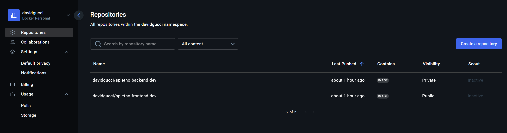
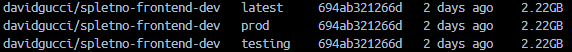
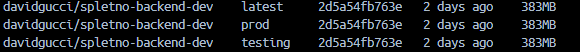
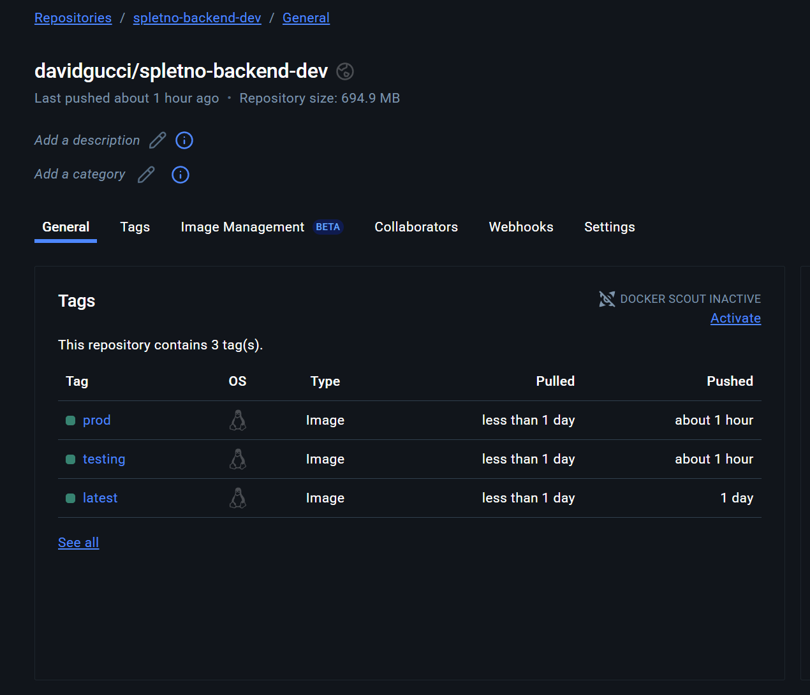
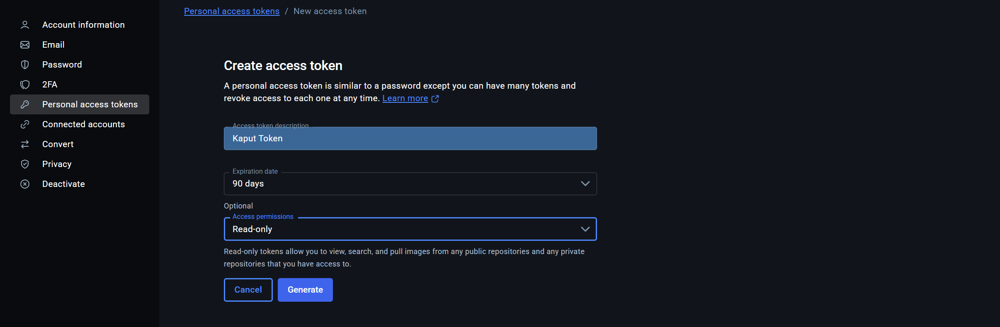
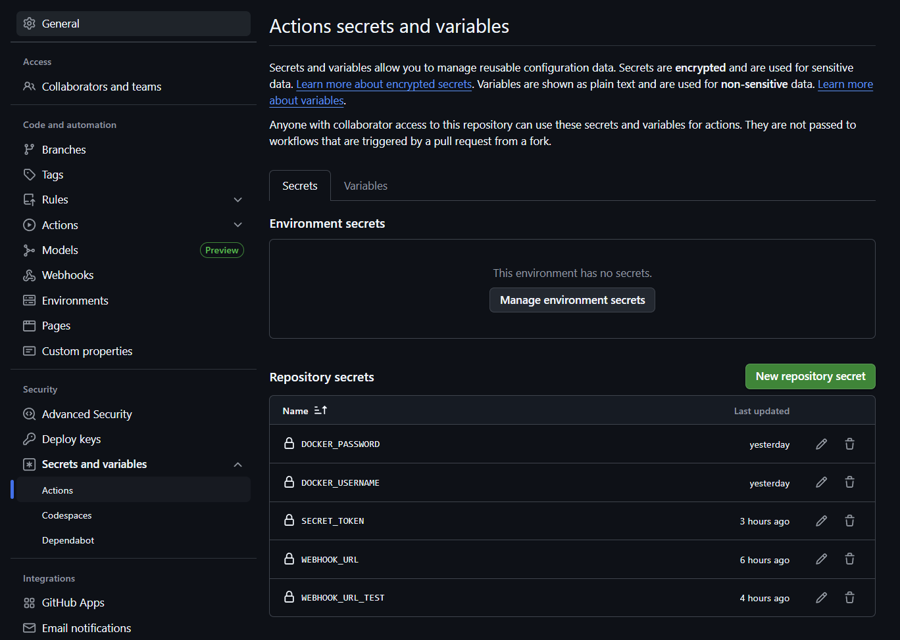
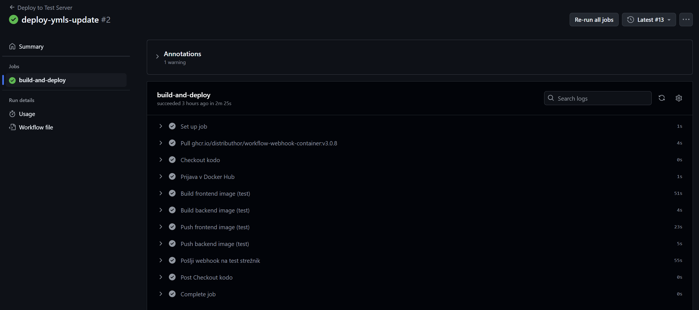
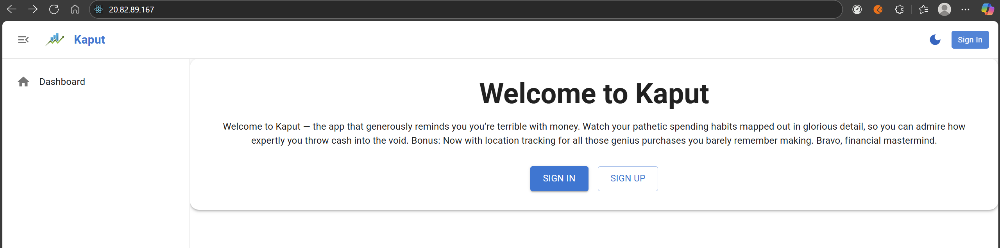

# Poročilo o vzpostavitvi CI/CD v projektu skupine Kaput

Člani:
- Luka Kuder (vodja skupine)
- Enej Kramar
- David Guček

## Docker Hub Container Registry

V tem delu smo pripravili Docker sliko naše aplikacije in jo uspešno naložili v Docker Hub z uporabo CLI ukazov. Postopek je potekal na naslednji način:

### 1. Prijava v Docker Hub

Za dostop do zasebnega Docker Hub repozitorija smo se najprej prijavili v svoj račun:

```bash
docker login
```

Po vnosu uporabniškega imena in gesla je bil dostop omogočen.

---

### 2. Gradnja Docker slike

Ustvarili smo dva repozitorija: `spletno-frontend-dev` in `spletno-backend-dev`, ki vsebujeta različne verzije slik (latest, prod, testing).
Z ukazom `docker build` smo ustvarili slike, ki bodo služile kot kontejner za našo aplikacijo:


```bash
docker build -t davidgucci/spletno-frontend-dev:latest -f DockerFile.frontend frontend
docker build -t davidgucci/spletno-frontend-dev:prod -f DockerFile.frontend frontend
docker build -t davidgucci/spletno-frontend-dev:testing -f DockerFile.frontend frontend

docker build -t davidgucci/spletno-backend-dev:latest -f DockerFile.frontend frontend
docker build -t davidgucci/spletno-backend-dev:prod -f DockerFile.frontend frontend
docker build -t davidgucci/spletno-backend-dev:testing -f DockerFile.frontend frontend

-f backend/DockerFile.backend backend
```

- `-t` označuje oznako slike (`tag`), ki mora vsebovati tudi naše Docker Hub uporabniško ime (`davidgucci`)
- `.` pomeni, da se `Dockerfile` nahaja v trenutni mapi

---

### 3. Pregled ustvarjenih slik

Sliko smo preverili z ukazom:

```bash
docker images
```

Izpis je pokazal nove slike, ki smo jih pravkar zgradili:




---

### 4. Nalaganje slike na Docker Hub

Ko je bila slika zgrajena in pravilno označena, smo jo naložili na Docker Hub:



```bash
docker push davidgucci/spletno-frontend-dev:latest
docker push davidgucci/spletno-frontend-dev:prod
docker push davidgucci/spletno-frontend-dev:testing
docker push davidgucci/spletno-backend-dev:latest
docker push davidgucci/spletno-backend-dev:prod
docker push davidgucci/spletno-backend-dev:testing
```

S tem je slika postala dostopna na naslovu:  
[https://hub.docker.com/repository/docker/davidgucci/spletno-frontend-dev](https://hub.docker.com/repository/docker/davidgucci/spletno-frontend-dev)
Zdaj imamo repozitorija `spletno-frontend-dev` in `spletno-backend-dev`, ki vsebujeta različne verzije slik (latest, prod, testing).
---

## GitHub Actions Workflows

Za avtomatizacijo CI/CD smo uporabili GitHub Actions in ustvarili dva ločena workflowa za testno in produkcijsko okolje.

### Struktura projekta

```
/spletno
├── backend/
│   └── DockerFile.backend
├── frontend/
│   └── DockerFile.frontend
├── docker-compose.yml
├── Caddyfile
└── .github/workflows/
    ├── deploy-test.yml
    └── deploy-prod.yml
```

---

### Namen workflowov

Vzpostavljena sta bila naslednja workflowa:

- `deploy-dev.yml` → ob vsakem pushu na `develop` vejo
- `deploy-prod.yml` → ob vsakem pushu na `main` vejo

Ob vsakem sproženju se izvede:
1. gradnja Docker slik (frontend in backend),
2. nalaganje slik na Docker Hub,
3. pošiljanje webhook obvestila strežniku.

---

### `deploy-dev.yml`

```yaml
name: Deploy to Test Server

on:
  push:
    branches: [develop]

jobs:
  build-and-deploy:
    runs-on: ubuntu-latest

    steps:
      - name: Checkout kodo
        uses: actions/checkout@v3

      - name: Prijava v Docker Hub
        run: echo "${{ secrets.DOCKER_PASSWORD }}" | docker login -u "${{ secrets.DOCKER_USERNAME }}" --password-stdin

      - name: Build frontend image (test)
        run: docker build -t ${{ secrets.DOCKER_USERNAME }}/spletno-frontend-dev:testing -f frontend/DockerFile.frontend frontend

      - name: Build backend image (test)
        run: docker build -t ${{ secrets.DOCKER_USERNAME }}/spletno-backend-dev:testing -f backend/DockerFile.backend backend

      - name: Push frontend image (test)
        run: docker push ${{ secrets.DOCKER_USERNAME }}/spletno-frontend-dev:testing

      - name: Push backend image (test)
        run: docker push ${{ secrets.DOCKER_USERNAME }}/spletno-backend-dev:testing

      - name: Pošlji webhook na test strežnik
        if: success()
        uses: distributhor/workflow-webhook@v3
        with:
          webhook_url: ${{ secrets.WEBHOOK_URL_TEST }}
          method: POST
          body: '{ "environment": "testing", "status": "updated" }'
          headers: |
            X-SECRET-TOKEN: ${{ secrets.SECRET_TOKEN }}
```

### `deploy-prod.yml`

```yaml
name: Deploy to Production Server

on:
  push:
    branches: [main]

jobs:
  build-and-deploy:
    runs-on: ubuntu-latest

    steps:
      - name: Checkout kodo
        uses: actions/checkout@v3

      - name: Prijava v Docker Hub
        run: echo "${{ secrets.DOCKER_PASSWORD }}" | docker login -u "${{ secrets.DOCKER_USERNAME }}" --password-stdin

      - name: Build frontend image (prod)
        run: docker build -t ${{ secrets.DOCKER_USERNAME }}/spletno-frontend-dev:prod -f frontend/DockerFile.frontend frontend

      - name: Build backend image (prod)
        run: docker build -t ${{ secrets.DOCKER_USERNAME }}/spletno-backend-dev:prod -f backend/DockerFile.backend backend

      - name: Push frontend image (prod)
        run: docker push ${{ secrets.DOCKER_USERNAME }}/spletno-frontend-dev:prod

      - name: Push backend image (prod)
        run: docker push ${{ secrets.DOCKER_USERNAME }}/spletno-backend-dev:prod

      - name: Pošlji webhook na production strežnik
        if: success()
        uses: distributhor/workflow-webhook@v3
        with:
          webhook_url: ${{ secrets.WEBHOOK_URL_PROD }}
          method: POST
          body: '{ "environment": "production", "status": "updated" }'
          headers: |
            X-SECRET-TOKEN: ${{ secrets.SECRET_TOKEN }}
```
---

### Ustvarjanje GitHub Personal Access Tokena (PAT) za prijavo

GitHub Personal Access Token (PAT) je varnostni ključ, ki omogoča varno in avtomatizirano prijavo v GitHub API ter izvajanje ukazov, kot so kloniranje repozitorijev, potiskanje sprememb ali dostop do zasebnih repozitorijev, brez potrebe po vnosu uporabniškega imena in gesla. Token smo ustvarili znotraj nastavitev GitHub računa, kjer lahko natančno določiš obseg dovoljenj, ki jih token vsebuje, kar pomeni, da lahko omejiš njegove pravice le na tiste funkcije, ki jih tvoja aplikacija ali skripta potrebuje. Uporaba PAT-ja je varnejša kot shranjevanje gesla, saj ga lahko kadar koli prekličeš ali zamenjaš brez vpliva na tvoj glavni račun, poleg tega pa je token enostavno integrirati v avtomatizirane procese, kot so GitHub Actions ali skripte za neprekinjeno integracijo in dostavo (CI/CD).

### Ustvarjanje Docker Personal Access Tokena (PAT) za prijavo

Docker Personal Access Token je poseben varnostni žeton, ki omogoča varno prijavo v Docker Hub brez uporabe gesla. Uporablja se predvsem v avtomatiziranih okoljih, kot so CI/CD sistemi ali skripte, ki morajo samodejno dostopati do Docker repozitorijev za poteg ali objavo slik. Token smo ustvarili znotraj varnostnih nastavitev Docker Hub računa, kjer smo ga poimenovali in mu dodelili ustrezne pravice. Uporaba tokena omogoča boljši nadzor in varnost, saj se geslo računa ne deli z zunanjimi orodji, hkrati pa lahko token enostavno shranite kot okoljsko spremenljivko in ga vključite v avtomatizirane procese, kar bistveno zmanjša tveganje nepooblaščenega dostopa in omogoča fleksibilnejše upravljanje dostopa do vaših Docker virov.


### GitHub Secrets uporabljeni

| Ime                | Namen                                |
|--------------------|--------------------------------------|
| `DOCKER_USERNAME`  | Uporabniško ime za Docker Hub        |
| `DOCKER_PASSWORD`  | Geslo za Docker Hub (PAT)            |
| `WEBHOOK_URL_TEST` | Webhook URL za testni strežnik       |
| `WEBHOOK_URL`      | Webhook URL za produkcijski strežnik |

Secrets se dodajo pod:  
**Repo > Settings > Secrets and variables > Actions > New secret**


---

### Dodatni možni workflowi

#### Testiranje (Continuous Integration)
- `test.yml` workflow:
    - `npm test` za backend
    - `npm run test` za frontend

#### Linting (preverjanje kode)
- ESLint (frontend)
- flake8 (backend)

#### Formatiranje
- Prettier (JS/TS)
- Husky (pre-commit hook)

#### Varnostne prakse
- `npm audit`
- `docker scan`

#### Obvestila
- Discord/Slack webhook za status `build`/`deploy`

---

## GitHub Actions Workflow

### Namen

Vzpostavljen je bil GitHub Actions workflow za avtomatsko gradnjo Docker slik, njihov prenos na Docker Hub ter sprožitev webhook sporočila, ki omogoča avtomatski deploy na strežniku.


### Struktura workflowa (`.github/workflows/deploy-prod.yml`)

```yaml
name: Deploy Production

on:
  push:
    branches:
      - main

jobs:
  build-and-push:
    runs-on: ubuntu-latest
    steps:
      - name: Checkout code
        uses: actions/checkout@v3

      - name: Log in to Docker Hub
        uses: docker/login-action@v2
        with:
          username: ${{ secrets.DOCKER_USERNAME }}
          password: ${{ secrets.DOCKER_PASSWORD }}

      - name: Build and push backend image
        run: |
          docker build -t ${{ secrets.DOCKER_USERNAME }}/kaput-backend:latest -f backend/DockerFile.backend .
          docker push ${{ secrets.DOCKER_USERNAME }}/kaput-backend:latest

      - name: Build and push frontend image
        run: |
          docker build -t ${{ secrets.DOCKER_USERNAME }}/kaput-frontend:latest -f frontend/DockerFile.frontend .
          docker push ${{ secrets.DOCKER_USERNAME }}/kaput-frontend:latest

  trigger-webhook:
    needs: build-and-push
    runs-on: ubuntu-latest
    steps:
      - name: Pošlji webhook na production strežnik
        uses: distributhor/workflow-webhook@v3
        with:
          webhook_url: ${{ secrets.WEBHOOK_URL_PROD }}
          method: POST
          body: '{ "environment": "production", "status": "updated" }'
          headers: |
            X-SECRET-TOKEN: ${{ secrets.SECRET_TOKEN }}
```

### Struktura workflowa (`.github/workflows/deploy-test.yml`)

```yaml
name: Deploy to Test Server

on:
  push:
    branches: [develop]

jobs:
  build-and-deploy:
    runs-on: ubuntu-latest

    steps:
      - name: Checkout kodo
        uses: actions/checkout@v3

      - name: Prijava v Docker Hub
        run: echo "${{ secrets.DOCKER_PASSWORD }}" | docker login -u "${{ secrets.DOCKER_USERNAME }}" --password-stdin

      - name: Build frontend image (test)
        run: docker build -t ${{ secrets.DOCKER_USERNAME }}/spletno-frontend-dev:testing -f frontend/DockerFile.frontend frontend

      - name: Build backend image (test)
        run: docker build -t ${{ secrets.DOCKER_USERNAME }}/spletno-backend-dev:testing -f backend/DockerFile.backend backend

      - name: Push frontend image (test)
        run: docker push ${{ secrets.DOCKER_USERNAME }}/spletno-frontend-dev:testing

      - name: Push backend image (test)
        run: docker push ${{ secrets.DOCKER_USERNAME }}/spletno-backend-dev:testing

      - name: Pošlji webhook na test strežnik
        if: success()
        uses: distributhor/workflow-webhook@v3
        with:
          webhook_url: ${{ secrets.WEBHOOK_URL_TEST }}
          method: POST
          body: '{ "environment": "testing", "status": "updated" }'
          headers: |
            X-SECRET-TOKEN: ${{ secrets.SECRET_TOKEN }}

```
### Job za testiranje zaledja

Ta test preverja delovanje /users/echo endpointa. Pošlje podatke prek POST metode in pričakuje, da strežnik vrne enake podatke znotraj objekta received. Cilj je zagotoviti, da endpoint pravilno prejme in vrne poslani JSON objekt.

```
const request = require('supertest');
const app = require('../server');

describe('Tech for users/echo', () => {
it('Should echo back the data sent', async () => {
const testData = { message: 'User Luka K.', number: 42 };

        const res = await request(app)
            .post('/users/echo')
            .send(testData);

        expect(res.statusCode).toBe(200);
        expect(res.body).toEqual({ received: testData });
    });
});
```

### Možne razširitve workflowa

- **Avtomatsko testiranje**: Dodaj job za `npm test`, `pytest`, `jest` ipd.
- **Lintanje**: Dodaj linting korake (`eslint`, `black`, `flake8`, `prettier`...).
- **CI za več branch-ev**: Dodaj testiranje na vseh branchih, deploy pa samo za `main`.
- **Varnostne preverbe**: Uporabi `npm audit`, `safety`, `trivy`, `bandit` ipd.

---

## Webhook Strežnik

### Namen

Webhook strežnik sprejme HTTP POST zahtevo, preveri avtentikacijo, nato pa izvede avtomatski deploy: ustavi aktivne Docker kontejnere, prenese najnovejše slike in ponovno zažene aplikacijo.

### Namestitev Potrebnih Paketov

```bash
sudo apt update
sudo apt install python3 python3-pip docker.io docker-compose git -y
sudo pip3 install flask
```

## Dodajanje pravice Uporabniku `kaput` za Docker

```bash
sudo usermod -aG docker kaput
newgrp docker
```

### Koda (`webhook_server.py`)

Naša skripta webhook_server.py je preprosta, a učinkovita rešitev za avtomatizacijo nameščanja nove različice spletne aplikacije s pomočjo Webhook mehanizma, kot ga ponuja GitHub. S pomočjo knjižnice Flask smo omogočili, da strežnik posluša na določenem portu (privzeto 5002) in čaka na POST zahteve, ki jih sproži dogodek, kot je npr. potisk (push) v repozitorij.

Ko GitHub pošlje zahtevek na /deploy endpoint, skripta najprej preveri, ali je podpis zahtevka veljaven. To preverjanje se izvaja z uporabo HMAC algoritma SHA-256, ki preveri, ali je prejeti podpis enak podpisu, ki ga izračuna skripta na podlagi tajnega ključa (ki je definiran kot SECRET_TOKEN). Če podpis ni ustrezen, se zahtevek zavrne z odgovorom "Unauthorized".

Če je podpis pravilen, skripta nadaljuje z izvajanjem postopka nadgradnje:

1. Najprej se prijavi v Docker Registry z uporabo uporabniškega imena in gesla, ki ju dobi iz okolja (DOCKER_USERNAME in DOCKER_PASSWORD).

2. Nato ustavi vse trenutno zagnane Docker containere z uporabo ukaza docker-compose down.

3. Potem prenese najnovejše verzije slik iz registrija z ukazom docker-compose pull.

4. In nazadnje, aplikacijo ponovno zažene z ukazom docker-compose up -d --build, ki tudi sproži morebitno ponovno izgradnjo.

Vsi ti ukazi se izvajajo v točno določenem direktoriju, nastavljenem v spremenljivki PROJECT_PATH, kar pomeni, da lahko skripto enostavno prilagodiš tudi drugim projektom.

Skripta je dodatno pripravljena na to, da se izvaja kot sistemska storitev s pomočjo systemd. V datoteki webhook.service je definirano, da se storitev samodejno zažene ob zagonu sistema, deluje pod uporabnikom kaput in ima nastavljen delovni direktorij. Tako poskrbimo, da skripta ne potrebuje ročnega zagona in da ob morebitnem izpadu sama ponovno zažene.

Seveda pa so pri takšni implementaciji možne tudi varnostne luknje, zato je pomembno, da jih prepoznamo in ustrezno naslovimo. Ena ključnih zaščit je že vgrajena – preverjanje HMAC podpisa. Vendar pa bi bilo smiselno dodati tudi dodatne zaščite, kot so:

- uporaba HTTPS (npr. z uporabo Nginx kot reverse proxy),

- omejevanje dostopa do endpointa po IP naslovu (firewall ali konfiguracija strežnika),

- skrivanje občutljivih podatkov, kot so Docker gesla,

- logiranje vseh poskusov dostopa in opozarjanje administratorja ob neuspelih zahtevkih.



```python
from flask import Flask, request, abort
import subprocess
import os
import hmac
import hashlib
from dotenv import load_dotenv

# Naloži .env datoteko, če obstaja
load_dotenv()

app = Flask(__name__)
GITHUB_SECRET = os.getenv("SECRET_TOKEN", "secret-token")
PROJECT_PATH = "/srv/kaput/spletno"
GIT_BRANCH = "dev"

def verify_github_signature(payload, signature_header):
    print("Verifying signature...")

    if not signature_header:
        print("No signature header provided.")
        return False

    try:
        sha_name, signature = signature_header.split('=')
        print(f"Signature header received: sha_name={sha_name}, signature={signature}")

        if sha_name != 'sha256':
            print("Unsupported hash algorithm")
            return False

        mac = hmac.new(GITHUB_SECRET.encode(), msg=payload, digestmod=hashlib.sha256)
        expected = mac.hexdigest()

        print(f"Expected signature: {expected}")
        is_valid = hmac.compare_digest(expected, signature)
        print(f"Signature valid? {is_valid}")
        return is_valid
    except Exception as e:
        print(f"Exception while verifying signature: {e}")
        return False

@app.route('/deploy', methods=['POST'])
def deploy():
    signature = request.headers.get("X-Hub-Signature-256")
    print(f"Received signature header: {signature}")

    if not verify_github_signature(request.data, signature):
        print("Signature verification failed.")
        return "Unauthorized", 401

    try:
        print("Logging into Docker registry...")
        subprocess.run(
            ["docker", "login", "-u", os.getenv("DOCKER_USERNAME"), "-p", os.getenv("DOCKER_PASSWORD")],
            check=True
        )

        print("Shutting down current containers...")
        subprocess.run(["docker-compose", "-f", "docker-compose.dev.yml", "down"], cwd=PROJECT_PATH, check=True)

        print("Pulling new images...")
        subprocess.run(["docker-compose", "-f", "docker-compose.dev.yml", "pull"], cwd=PROJECT_PATH, check=True)

        print("Starting containers with build...")
        subprocess.run(["docker-compose", "-f", "docker-compose.dev.yml", "up", "-d", "--build"], cwd=PROJECT_PATH, check=True)

        return "Deploy OK", 200

    except subprocess.CalledProcessError as e:
        print(f"Exception during deployment: {e}")
        return f"Error: {e}\nStdout: {e.stdout}\nStderr: {e.stderr}", 500

if __name__ == '__main__':
    app.run(host='0.0.0.0', port=5002)
```

---

### systemd Servis (`/etc/systemd/system/webhook.service`)

systemd je sistemski upravljalnik, ki omogoča samodejni zagon tvojega webhook strežnika ob zagonu sistema, njegovo ponovno zaganjanje v primeru napake, ter centralizirano upravljanje (s systemctl ukazi).

```ini
[Unit]
Description=Flask Webhook Server
After=network.target

[Service]
User=kaput
WorkingDirectory=/srv/kaput/spletno
ExecStart=/usr/bin/python3 /srv/kaput/spletno/webhook_server.py
Restart=always
Environment=SECRET_TOKEN=dckr_pat_example

[Install]
WantedBy=multi-user.target
```

#### Zagon storitve

```bash
sudo systemctl daemon-reload
sudo systemctl enable webhook
sudo systemctl start webhook
```

#### Preverjanje stanja in logov

```bash
sudo systemctl status webhook
sudo journalctl -u webhook.service -b -f
```
---

#### Testiranje Webhook Strežnika
Za testiranje delovanja webhook strežnika smo uporabili `curl` ukaz:

```bash
curl -X POST http://localhost:5002/deploy \
  -H "X-Hub-Signature-256: sha256=<valid-signature>" \
  -H "Content-Type: application/json" \
  -d '{}'
```

## Varnostni Vidiki

Naša implementacija CI/CD z uporabo webhook strežnika ima nekaj varnostnih vidikov, ki preprečujejo zlorabe:
- HMAC verifikacija zagotovi, da je Webhook legitimen
- Okoljske spremenljivke (SECRET_TOKEN, DOCKER_USERNAME, DOCKER_PASSWORD) niso zapisane v kodi – skripta uporablja .env in systemd environment

### Potencialne ranljivosti

- Nezaščiten webhook endpoint (možnost zlorabe)
- Brez HTTPS zaščite (možnost MITM napada)
- Slaba hramba gesel/tokenov
- Python proces z previsokimi privilegiji

### Ukrepi za zaščito

- Uporaba **X-SECRET-TOKEN** oz. **X-Hub-Signature-256** in preverjanje HMAC
- Uporaba systemd in omejevanje uporabnika (`User=kaput`)
- Aktivacija HTTPS z uporabo **Caddy** ali **nginx** + Let's Encrypt
- IP whitelisting in rate limiting (npr. s Flask-Limiter)
- Priporočena uporaba naprednejših metod avtentikacije (npr. JWT)

---

## Zaključek

Vzpostavljena je zanesljiva CI/CD pot, ki vključuje:

1. **GitHub Actions** izdela in naloži Docker slike v Docker Hub.
2. Sproži **Webhook** s preverjeno avtentikacijo.
3. **Strežnik** ustavi trenutne kontejnere, prenese nove slike in zažene novo različico aplikacije.

---
