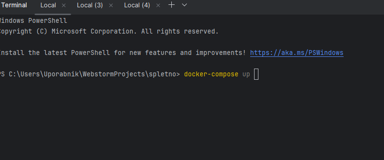
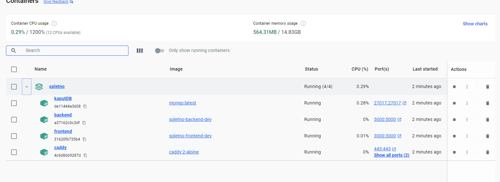

# Poročilo: Docker postavitev aplikacije

## Namen

Cilj postavitve je omogočiti enostavno, ponovljivo in ločeno razvojno okolje za celotno aplikacijo, ki vključuje:
- **Frontend** (React),
- **Backend** (Node.js/Express),
- **MongoDB** podatkovno bazo,
- **Caddy** za usmerjanje HTTP zahtev (reverse proxy).

Z uporabo Dockerja zagotovimo:
- enotno okolje za vse razvijalce,
- enostaven zagon aplikacije z enim ukazom (`docker-compose up`),
- boljšo organizacijo in modularnost kode.

izdelati smo morali docker file za back in fornt end prav tako smo morali izdelati caddy file in pa docker-compose.yml ki vse poveže skupaj 

## 1. Docker file za backend
za back-end smo naredili docker file imenovan *DockerFile.backend*
```yaml
# definicija node verzije 
FROM node:20-slim as dev

# Nastavi delovni imenik v kontejnerju
WORKDIR /appsa

# Kopiraj datoteki package.json in package-lock.json v kontejner
COPY backend/package*.json ./

# Namesti odvisnosti aplikacije
RUN npm install

# Kopiraj izvorno kodo aplikacije v kontejner
COPY backend/ .

# Zaženi aplikacijo
CMD ["npm", "start"]

```
---
## 2. Docker file za frontend
za back end smo naredili docker file imenovan *DockerFile.frontend*

```yaml
# definicija node verzije 
FROM node:20-slim as dev

# Nastavi delovni imenik v kontejnerju
WORKDIR /app

# Kopiraj datoteki package.json in package-lock.json v kontejner
COPY frontend/package*.json ./

# Namesti odvisnosti aplikacije
RUN npm install

  # Kopiraj izvorno kodo aplikacije v kontejner
COPY frontend/ .

# Zaženi aplikacijo
CMD ["npm", "start"]
```
---

## 3. CaddyFile
```yaml
:80 {
  # Obravnava vseh zahtevkov, ki se začnejo z /api/
  handle_path /api/* {
  # Posreduj zahteve na backend strežnik na portu 5000
  reverse_proxy backend:5000
  }
  # Obravnava vseh drugih zahtevkov (npr. statične strani)
  handle {
  # Posreduj zahteve na frontend strežnik na portu 3000
  reverse_proxy frontend:3000
  }
}
```

## 4. Docker-compose.yml
### 1. **MongoDB baza (`db`)**
```yaml
  mongo:
    # Izberemo verzijo MongoDB
    image: mongo:2-alpine

    # Nastavimo ime kontejnerja
    container_name: kaputDB

    # Kontejner se samodejno ponovno zažene, razen če ga ročno ustavimo
    restart: unless-stopped

    # Posredujemo vrata iz gostitelja na kontejner (27017 je privzeta vrata MongoDB)
    ports:
      - "27017:27017"

    # Določimo lokacijo, kjer se bo shranjevala baza podatkov (volumen na gostitelju)
    volumes:
      - kaput-data:/data/db


```
### 2. **Konfiguracija backend (` backend-dev`)**
```yaml
  backend-dev:
    # Nastavimo ime kontejnerja
    container_name: backend

    # Gradimo sliko iz podane poti in Dockerfile-a ter uporabimo ciljno fazo "dev"
    build:
      context: .
      dockerfile: backend/DockerFile.backend
      target: dev

    # Povežemo lokalno mapo z /app v kontejnerju za razvoj v živo
    volumes:
      - ./backend:/app            # Lokalna mapa z backend kodo
      - /app/node_modules         # Da ohranimo node_modules znotraj kontejnerja 
      - 
    # Posredujemo vrata za dostop do aplikacije
    ports:
      - "5000:5000"

    # Uvozimo okoljske spremenljivke iz datoteke .env
    env_file:
      - ./backend/.env

    # Kontejner se samodejno ponovno zažene, razen če ga ročno ustavimo
    restart: unless-stopped

    # Poskrbimo, da se backend zažene šele po MongoDB
    depends_on:
      - mongo

```
### 3. **Konfiguracija backend (`frontend-dev`)**
```yaml
  frontend-dev:
    # Nastavimo ime kontejnerja
    container_name: frontend

    # Gradimo sliko iz podane poti in Dockerfile-a ter uporabimo ciljno fazo "dev"
    build:
      context: .
      dockerfile: frontend/DockerFile.frontend
      target: dev

    # Povežemo lokalno mapo z /app v kontejnerju za razvoj v živo
    volumes:
      - ./frontend:/app           # Lokalna mapa z frontend kodo
      - /app/node_modules         # Ohranimo node_modules v kontejnerju, da preprečimo konflikte z lokalnimi paketi

    # Posredujemo vrata za frontend aplikacijo 
    ports:
      - "3000:3000"

    # Uvozimo okoljske spremenljivke iz datoteke .env
    env_file:
      - ./frontend/.env

    # Kontejner se samodejno ponovno zažene, razen če ga ročno ustavimo
    restart: unless-stopped

    # Poskrbimo, da se frontend zažene po backendu
    depends_on:
      - backend-dev

```
### 3. **Konfiguracija caddz (`caddy`)**
```yaml
  caddy:
    # Uporabimo Caddy sliko z majhno velikostjo 
    image: caddy:2-alpine

    # Nastavimo ime kontejnerja
    container_name: caddy

    # Posredujemo vrata 80 in 443
    ports:
      - "80:80"
      - "443:443"

    # Določimo volumne za Caddy:
    volumes:
      - caddy_data:/data                       # Za caddy podatke
      - caddy_config:/config                   # Za notranjo konfiguracijo Caddy-ja
      - ./Caddyfile:/etc/caddy/Caddyfile      # Naš Caddyfile s pravili za usmerjanje

    # Poskrbimo, da se Caddy zažene po backendu in frontendu
    depends_on:
      - frontend-dev
      - backend-dev

    # Samodejni ponovni zagon, razen če ga ročno ustavimo
    restart: unless-stopped

  # Definicija volumnov, ki jih uporabljajo mongo in caddy
  volumes:
    kaput-data:     # Za MongoDB podatke
    caddy_data:     # Za caddy podatke
    caddy_config:   # Za konfiguracijske podatke Caddy-ja

```

## Zagon
zažene se z komando docker-compose up

po izvedbi komande se nam na dockerju naložijo datoteke in ustvarijo oz poženejo kontejnerji

na sliki recimo vidimo imena vseh kontejnerjev, ki smo jih definirali prav tako se vidi, kdaj so bili zagnani koliko CPU zavzamejo in koliko zasedejo v RAM-u in podobno  
